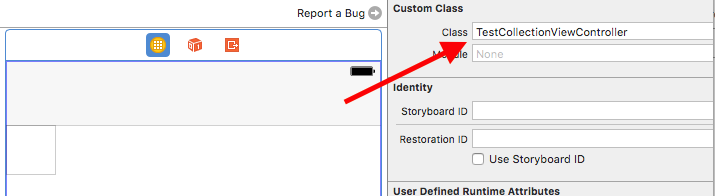
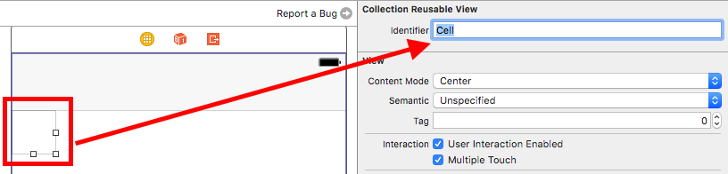
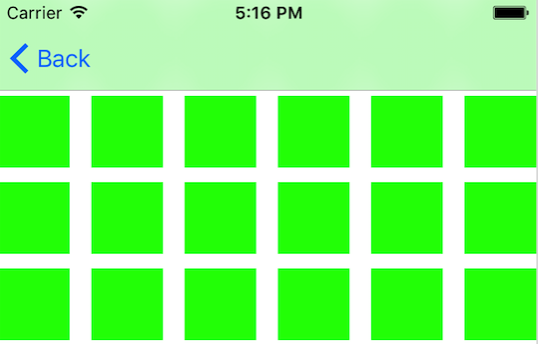

### Netty 的 ProtobufVarint32LengthFieldPrepender 粘包拆包处理
处理方式：在数据包前加入该数据包的长度标示，该标示所占字节数为1--4个字节
`长度标示` 的占用的字节数是根据具体长度确定的，
###### 1 计算长度标示长度
    
|    移位    |  值 (二进制) 0   |        1        |       2         |       3         |   值（16进制）    |
|-----------|-----------------|-----------------|-----------------|-----------------|-----------------|
| << 0      | 1 1 1 1 1 1 1 1 | 1 1 1 1 1 1 1 1 | 1 1 1 1 1 1 1 1 | 1 1 1 1 1 1 1 1 | 0X FF FF FF FF  |                  
| << 7      | 1 1 1 1 1 1 1 1 | 1 1 1 1 1 1 1 1 | 1 1 1 1 1 1 1 1 | 1 0 0 0 0 0 0 0 | 0X FF FF FF 80  |
| << 14     | 1 1 1 1 1 1 1 1 | 1 1 1 1 1 1 1 1 | 1 1 0 0 0 0 0 0 | 0 0 0 0 0 0 0 0 | 0X FF FF C0 00  |
| << 21     | 1 1 1 1 1 1 1 1 | 1 1 1 0 0 0 0 0 | 0 0 0 0 0 0 0 0 | 0 0 0 0 0 0 0 0 | 0X FF E0 00 00  |
| << 28     | 1 1 1 1 0 0 0 0 | 0 0 0 0 0 0 0 0 | 0 0 0 0 0 0 0 0 | 0 0 0 0 0 0 0 0 | 0x F0 00 00 00  |

     
     - (NSInteger) computeByteSizeForInt32:(int32_t) value{
    		if ((value & (0xffffffff <<  7)) == 0) {
            	return 1;
        	}
        	if ((value & (0xffffffff << 14)) == 0) {
            	return 2;
        	}
        	if ((value & (0xffffffff << 21)) == 0) {
            	return 3;
        	}
        	if ((value & (0xffffffff << 28)) == 0) {
            	return 4;
        	}
        	return 5;
        }
      
      
      
###### 2 根据`长度标示的字节长度` 在相应的内存范围内写入数据包的长度。（此处的写入方式，跟我所想不太一样）
如下是java 代码描述的逻辑：
    
     while (true) {
            if ((value & ~0x7F) == 0) {
                out.writeByte(value);
                return;
            } else {
                out.writeByte((value & 0x7F) | 0x80); //保持每个字节的最高位总是1
                value >>>= 7;
            }
        }
         
        
  *** `>>`  左端补齐的是最高位的符号位 ***
      
      eg:
         
        9   ---> 00000000 00000000 00000000 00000100
      	>>1 ---> 00000000 00000000 00000000 00000100
      	
    	-9  ---> 11111111 11111111 11111111 11110111
    	>>1 ---> 11111111 11111111 11111111 11111011
      
  *** `>>>`  java中表示，向右移位，左端补齐的`0`,对于正数来说等价于`>>`,对于负数来说是不同的 ***
  
      eg:
      
        9    ---> 00000000 00000000 00000000 00000100
      	>>>1 ---> 00000000 00000000 00000000 00000100
       
  		-9  ---> 11111111 11111111 11111111 11110111
       >>>1 ---> 01111111 11111111 11111111 11111011
                 
  
  0x7F  ---->   0111 1111
  
  ~0x7F ---->   1000 0000
  
  0x80  ---->   1000 0000
  
  如果value只用一个字节就可以表示，那么 value & 1000 0000  必然等于0  这种情况value 就表示数据包的长度。否则 
  假设 
      
      value = 129       ----> 0000 0000 1000 0001;
      value & 1000 0000 ----> 1000 0000;  不等于0
      
      (value & 0111 1111) | 1000 0000 --> 1000 0001;   写入
      
      1000 001 >>> 7  --->  0000 0001 -->  下一次循环
      
      value = 1  ---> 0000 0001
      value & 1000 0000 ---> 0000 0000  等于0，把value 写入
      
      最后数据写入两个字节
      1000 0001 0000 0001
      
      
### Netty ProtobufVarint32FrameDecoder  读取长度标示时的处理

* 以  129 为例 
	根据上面分析，129 被发送时，处理为  1000 0001 0000 0001  总共占用两个字节
	首先读取第一个字节 int8_t temp = 1000 0001   再有符号数中 改制为 -127
	如果读取到的第一个字节为负数，那么 int result = 1000 0001 & 0111 1111(127) = 0000 0001
	这时再读取一个字节 temp = 0000 0001;如果 temp >= 0  result = result | (temp << 7) 
	---> 0000 00001 << 7 = 0100 0000 --> 0000 0001 | 1000 0000 = 1000 0001 = 129 
	
	
	
###  Objective-C环境的protobuf 使用
参考
http://www.vviicc.com/blog/use-of-protobuf-3-0-0-for-objective-c/
	
###  参考博客
    http://blog.sunnyxx.com/2015/06/12/objc-new-features-in-2015/     
    http://mobile.51cto.com/hot-404891.htm
    
    //基础知识
    http://mobile.51cto.com/hot-404891.htm
    http://blog.sunnyxx.com/2015/06/12/objc-new-features-in-2015/
    http://wxgbridgeq.github.io/blog/2015/07/09/effective-oc-note-second/
    http://www.jianshu.com/p/9368ce9bb8f9
    
    //多线程
    http://www.jianshu.com/p/2de9c776f226
    http://www.jianshu.com/p/813f7d58935d
    https://blog.cnbluebox.com/blog/2014/07/01/cocoashen-ru-xue-xi-nsoperationqueuehe-nsoperationyuan-li-he-shi-yong/
    http://blog.csdn.net/kiki1985/article/details/8734999
    http://www.jianshu.com/p/fe1fec3d198f
    
    //直播
    http://www.cnblogs.nbhczl.com/oldmanlv/p/5625923.html
    
    //开源总结
    http://www.bigcode.top/ios-mac-open-source-projects-libraries-and-learning-blog-information/
    
    
    
  [监听wifi变化](http://ju.outofmemory.cn/entry/197886)  
  [CocoaLumberjack 使用](http://www.cocoachina.com/industry/20140414/8157.html) 🔗<http://blog.csdn.net/jia12216/article/details/44412697>
    
  [微信支付](https://pay.weixin.qq.com/wiki/doc/api/app/app.php?chapter=11_1)
  [AutoLayout](https://github.com/smileyborg/UIView-AutoLayout)🔗
  <https://github.com/luodezhao/Autolayout_Demo>🔗<https://github.com/Buglife/Floater_>
    
### Xcode最常用的快捷键整理
    
    http://www.jianshu.com/p/2b5ece8e1602
     
### github上关于iOS的各种开源项目集合
    
    http://blog.csdn.net/shaobo8910/article/details/52347215
    
    
### UICollectionView 的使用
UICollectionView 是比 UITableview 更加强大的表格视图，它可以轻松优雅地完成一些UITableView不太能胜任工作。
比如说当我需要一个可以水平方向滑动列表时，tableView 来完成就需要将其旋转180度的才可以完成，（其中的cell也要旋转），当年我就这么干过。而UICollectionView可以轻松的完成这项需求。

###### 使用 StoryBoard 创建 UICollectionViewController
这是最简单的方式，直接在StoryBoard中拖拽一个UICollectionViewController

* 创建相应的UICollectionViewController的子类（TestCollectionViewController），实现 datasource，
	
      - (NSInteger)numberOfSectionsInCollectionView:(UICollectionView *)collectionView {
      		return 1;
      }
      
      - (NSInteger)collectionView:(UICollectionView *)collectionView 
           numberOfItemsInSection:(NSInteger)section {
      		return 1000;
      }
      
      -(UICollectionViewCell *)collectionView:(UICollectionView *)collectionView 
                       cellForItemAtIndexPath:(NSIndexPath *)indexPath {
    
    	     UICollectionViewCell *cell = 
    	     	[collectionView dequeueReusableCellWithReuseIdentifier:@"Cell"
    	     	                                          forIndexPath:indexPath];
             cell.backgroundColor  = [UIColor greenColor];
    
    	    return cell;
	   }

      
* 设置类名

* 然后设置UICollectionCell的identifier 就可以了

* 运行效果

上述步骤中不设置cell的identifier  发现程序也可以正常工作。
如果再删除viewDidLoad中的`[self.collectionView registerClass:[UICollectionViewCell class] forCellWithReuseIdentifier:reuseIdentifier];` 发现程序就奔溃了 😡
     
    *** Assertion failure in -[UICollectionView    
    _dequeueReusableViewOfKind:withIdentifier:forIndexPath:viewCategory:],
     /BuildRoot/Library/Caches/com.apple.xbs/Sources/UIKit_Sim/
     UIKit-3599.6/UICollectionView.m:4922
     Terminating app due to uncaught exception 'NSInternalInconsistencyException',
      reason: 'could not dequeue a view of kind: UICollectionElementKindCell 
      with identifier Cell - must register a nib or a class for the identifier 
      or connect a prototype cell in a storyboard'

    
从错误信息中可以看出是因为没有注册该cell导致的,
但是如果重新设置cell的identifier，还是不调用registerClass 方法，程序依然可以正确运行。
这说明，如果设置了StoryBoard中UICollectionViewCell的identifier，ios会自动注册cell。

###### 在Storyboard中其他视图控制器中使用UICollectionView
这是最常见的使用场景，这种情况下可以随意调整 UICollectionView的size，这种情况下在UICollectionView添加cell，特变不便于编辑cell，所以cell的创建可以用代码和xib结合的方式常见，不过使用这种方式时需要使用`registerNib`方法注册cell。
    
      
      
      
      

###  关于视频大小自适应的解决方法 
ios 提供了一个方法  

     CGRect AVMakeRectWithAspectRatioInsideRect(CGSize aspectRatio, CGRect boundingRect)
     
 这个方法跟 `AVSampleBufferDisplayLayer` 的属性`videoGravity`等于`AVLayerVideoGravityResizeAspect` 的效果一样

`AVLayerVideoGravityResizeAspectFill`的效果是把视频的内容填满窗口，这样超出屏幕部分不会被显示

如果要自己实现这样一个效果改如何计算视频的实际区域呢，苹果并没有想`AVMakeRectWithAspectRatioInsideRect`一样提供相应的方法，于是我自己实现了一个 方法名是`AVMakeRectWithAspectFillRatioInsideRect` 这样与`AVLayerVideoGravityResizeAspectFill` 相对应
       
    CGRect AVMakeRectWithAspectFillRatioInsideRect(CGSize aspectFillSize, CGRect boundingRect){
    	CGFloat boundWidth = boundingRect.size.width;
    	CGFloat boundHeight = boundingRect.size.height;
    	CGFloat widthRatio = boundWidth / aspectFillSize.width ;
    	CGFloat heightRatio = boundHeight / aspectFillSize.height;
    	CGSize widthAspectSize = CGSizeZero;
    	CGSize heightAspectSize = CGSizeZero;
    	
    	if (aspectFillSize.width >= boundWidth) {
        	widthAspectSize = CGSizeMake(boundWidth, widthRatio > 1 ? aspectFillSize.height / widthRatio : 									aspectFillSize.height * widthRatio );
    	}
    	else{
        	widthAspectSize = CGSizeMake(boundWidth, widthRatio > 1 ? aspectFillSize.height * widthRatio : 					aspectFillSize.height / widthRatio);
    	}
    
    	if (aspectFillSize.height >= boundHeight) {
        	heightAspectSize = CGSizeMake(heightRatio > 1 ? aspectFillSize.width / heightRatio : aspectFillSize.width * heightRatio, boundHeight);
    	}
    	else{
        	heightAspectSize = CGSizeMake(heightRatio > 1 ? aspectFillSize.width * heightRatio : aspectFillSize.width / heightRatio, boundHeight);
    	}
    
    	CGFloat widthOffset = fabs(heightAspectSize.width - boundWidth);
    	CGFloat heightOffset = fabs(widthAspectSize.height - boundHeight);
    	CGSize bestSize = CGSizeZero;
    	if(widthAspectSize.height >= boundHeight && heightAspectSize.width >= boundWidth){
        	bestSize = widthOffset < heightOffset ?  heightAspectSize : widthAspectSize;
    	}
    	else if(widthAspectSize.height > boundHeight){
        	bestSize = widthAspectSize;
    	}
    	else {
        	bestSize = heightAspectSize;
    	}
    
    	return CGRectMake((boundWidth - bestSize.width) / 2, (boundHeight - bestSize.height) / 2, bestSize.width, bestSize.height);       
    }

### MKMapView 高度约束小于413  （iOS 9）
      Unable to simultaneously satisfy constraints.
	Probably at least one of the constraints in the following list is one you don't want. 
	Try this: 
		(1) look at each constraint and try to figure out which you don't expect; 
		(2) find the code that added the unwanted constraint or constraints and fix it. 
	(Note: If you're seeing NSAutoresizingMaskLayoutConstraints that you don't understand, refer to the documentation for the UIView property translatesAutoresizingMaskIntoConstraints) 
      
      "<NSLayoutConstraint:0x12623bb90 V:[MKMapView:0x126123360(412)]>",
      "<NSLayoutConstraint:0x12894cca0 UILayoutGuide:0x12894c760'Edge Insets'.top == MKMapView:0x126123360.top + 72>",
      "<NSLayoutConstraint:0x12894d0d0 UILayoutGuide:0x12894c760'Edge Insets'.bottom == MKMapView:0x126123360.bottom - 341>"
      
      Will attempt to recover by breaking constraint 
		<NSLayoutConstraint:0x141a60070 UILayoutGuide:0x13d87ee30'Edge Insets'.bottom == MKMapView:0x1422ea4b0.bottom - 341>

		Make a symbolic breakpoint at UIViewAlertForUnsatisfiableConstraints to catch this in the debugger.
		The methods in the UIConstraintBasedLayoutDebugging category on UIView listed in <UIKit/UIView.h> may also 		be helpful.

  
 
 
### AutoLayout
http://www.jianshu.com/p/4a4bc8f1eee8 
http://www.jianshu.com/p/fee69fedd4d0
https://lvwenhan.com/ios/431.html
http://www.cnblogs.com/dsxniubility/p/4266581.html
 	